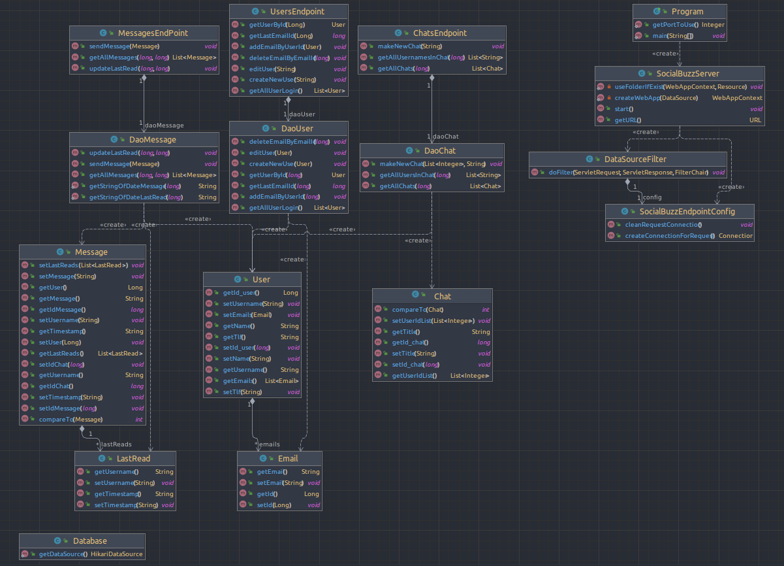

# [Link til azure deployment](http://pgr209-exam-socialbuzz-user.azurewebsites.net/)

# PG209 Backend programmering eksamen
 
Levert av:
* Kandidat 1023
* Kandidat 1014

Eksamensteksten er opp til tolkning om vi skal lage en post og/eller chat basert tjeneste.
Kandidater i denne eksamensinnleveringen har drøftet og konkludert med å lage en chattetjeneste 
som er meget inspirert etter Discord sin meldingsstruktur.

Etter “innlogging” som er valg av brukere skal det vises opp en liste med chatter (en til en og gruppe-chatter) 
som bruker har tilgang til. En til en chatter viser brukernavn som tittel i stedet for egenvalgt tittel, 
mens gruppechatter viser sin gitte tittel.

Det er to typer timestamp i chattendene. Første er tidspunkt når meldingen blir sent. 
Den kommer å vise en mer utfyllende dato eksempler:
* Today at 13:35
* Yesterday at 15:52
* 16 dec at 10:45
* 01 jan 2021 at 16:32

Andre typen timestamp komme å følge en minimalistisk stil for å minimere støy rundt selve meldingene. 
Tidspunkt eksempler med enkel stil:
* ~ 15 sec
* ~ 20 min
* ~ 3 days
* ~ 2 weeks
* ~ 4 months
* ~ 2 years 

# Funksjonalitet utenfor beskrivelse:
* Autocommit er slått av og styres igjennom filteret med manuel commit
* Servlettens config benytter en multithreaded connection pool som gir ut en aktiv connect per reguest.
  Filteret er configurert til å logge alle innkommende reguest type og URL, og Respons kode sendt til klient.
* Autodeploy til auzer sever med bruk av Github Actions
* Serveren benytter GET, PUSH, PUT og DELETE
* Redirect til forsiden ved bruk av ugyldig url

# Beskriv hvordan programmet skal testes:
* Maskinen må ha docker og jdk 17 installert på forhånd!
* Lag en fil med navn `application.properties` og baser innholde 
  fra fil `application.properties.template`. Husk å sette eget passord
* Kopier docker kommando fra template og database skal være klart. 
* Standard port er 8080, men kan endres igjennom fil Program
* Bygg programmet med `mvn package` og kjør fil `target/pgr209-exam-socialbuzz-1.0-SNAPSHOT.jar`
* Nås på url: `http://127.0.1.1:8080/`
* OBS OBS OBS Dette er HTTP!!! 
  Alt blir sent i klartekst, selv om du hoster lokalt. 
  Ikke bruk relevant brukernavn og passord i denne applikasjonen!
* Nettsiden skal inneholde flere brukere med en til en og gruppe chat med meldinger. 
* Mulighete til å lage ny bruker og endring av eldre. 
* Mulighet til å lage nye en til en og gruppe chatter med andre. 

# Bilder

ER-model for database for socialbuzz

Class-diagram from java-classes

## Sjekkliste for innleveringen

* [x] Dere har lest eksamensteksten
* [x] Koden er sjekket inn på github.com/pg209-2022 repository
* [ ] Dere har lastet opp en ZIP-fil lastet ned fra Github
* [x] Dere har committed kode med begge prosjektdeltagernes GitHub-konto (alternativt: README beskriver hvordan dere har jobbet)

## README.md

* [ ] Inneholder link til Azure Websites deployment
* [x] Inneholder en korrekt badge til GitHub Actions

* [ ] Beskriver hva dere har løst utover minimum
* [x] Inneholder et diagram over databasemodellen

## Koden

* [x] Oppfyller Java kodestandard med hensyn til indentering og navngiving

* [x] Er deployet korrekt til Azure Websites
* [x] Inneholder tester av HTTP og database-logikk
* [x] Bruker Flyway DB for å sette opp databasen
* [x] Skriver ut nyttige logmeldinger

## Basisfunksjonalitet

* [x] Kan velge hvilken bruker vi skal opptre som
* [x] Viser eksisterende meldinger til brukeren
* [x] Lar brukeren opprette en ny melding
* [x] Lar brukeren svare på meldinger
* [x] For A: Kan endre navn og annen informasjon om bruker
* [x] For A: Meldingslisten viser navnet på avsender og mottakere

## Kvalitet

* [x] Datamodellen er *normalisert* - dvs at for eksempel navnet på en meldingsavsender ligger i brukertallen, ikke i meldingstabellen
* [x] Når man henter informasjon fra flere tabellen brukes join, i stedet for 1-plus-N queries (et for hovedlisten og et per svar for tilleggsinformasjon)
* [x] Det finnes test for alle JAX-RS endpoints og alle DAO-er

